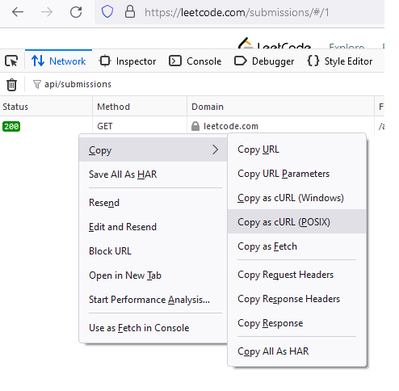

#  download_leetcode_submissions

Script download all your submissions from leetcode, filter them and add to git with submission timestamps.

No unhappy paths tested. (it's almost REPL dump)

Worked for me once... not sure if i'll ever would run it again or automate it.

require curl and git.

## Configuring:

Set folowing values in main.js as you wish:
```
filter_problems - don't add exactly these submissions to your git repo

only_accepted  - just in case if you want to add failures too

filter_newer_than - you run it second time!? likely you'll need to filter old submissions
```

replace stub in secret.js with your cURL request

You can get your cURL in firefox:
Open https://leetcode.com/submissions/

Settings->More tools-> Web Developer Tools 

 

